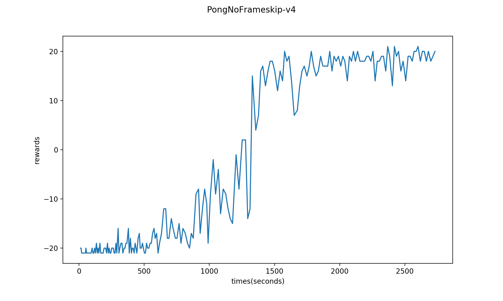
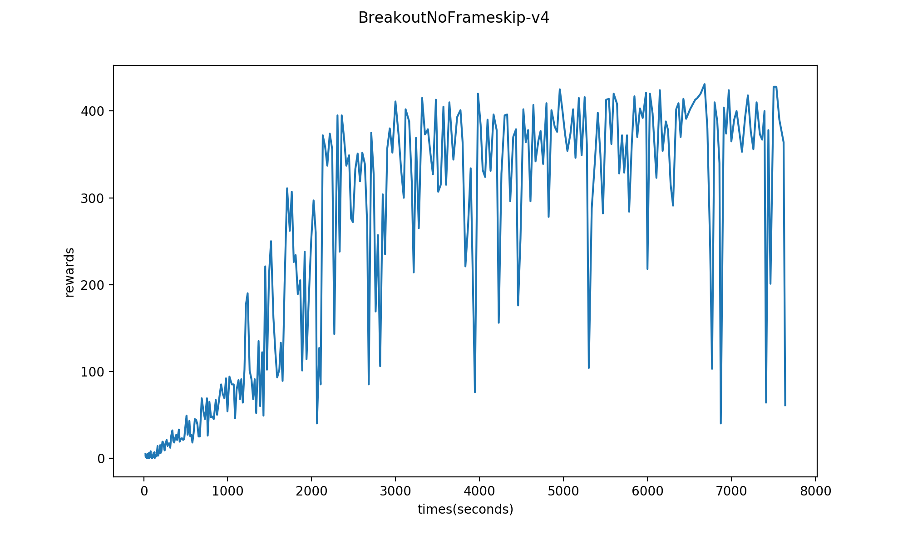

# pytorch-acer

An Implementation of [Sample Efficient Actor-Critic with Experience Replay](https://arxiv.org/abs/1611.01224).

The paper proposes an off-policy Actor Critic algorithm with Experience Replay(ACER) in order to increase sample efficiency of actor critic algorithm.

This repository is based on [pytorch-a2c-ppo-acktr](https://github.com/ikostrikov/pytorch-a2c-ppo-acktr) and [baselines/acer](https://github.com/openai/baselines/tree/master/baselines/acer). A lot of codes are borrowed from them. If there are any license/property problems, please contact me.

A few notes:
- Original paper have used A3C-like asynchronous update but I adopted A2C-like batch update used in openai's implementation for ACER.

- This implementation does not support continuous action space. Only works for atari game environments with discrete action spaces.

- Used `torch.autograd.grad` with `torch.autograd.backward` for TRPO implementation.

- Current RAM requirements are:
    - `--num-processes 4` : 7.8GB of RAM required
    - `--num-processes 8` : 13.3GB of RAM required
    - `--num-processes 16`: 24.3GB of RAM required
    - `--num-processes 32`: 46.5GB of RAM required


# Requirements
```
pytorch 0.4.1
numpy
gym
baselines
python 3.6
```

You can install gym and baselines for atari games:

```bash
git clone https://github.com/openai/baselines.git
cd baselines
pip install -e .
pip install 'atari[gym]'
```

# Examples

`python main.py --env 'PongNoFrameskip-v4' --num-processes 4 --recurrent-policy`



`python main.py --env 'BreakoutNoFrameskip-v4' --num-processes 16`



# Acknowledgements
- openai(https://github.com/openai/baselines)
- ikostrikov(https://github.com/ikostrikov/pytorch-a2c-ppo-acktr)